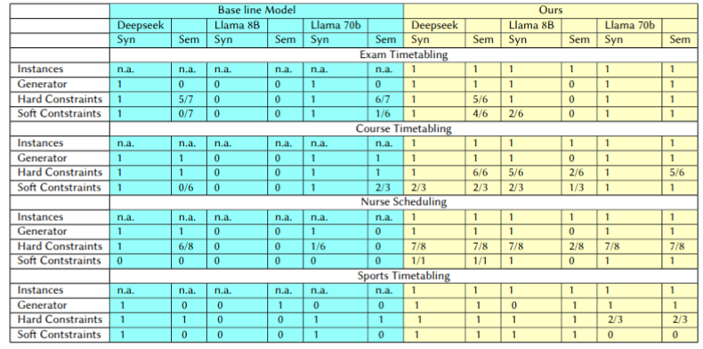

# SchASPLM
This repository contains our latest results on autoformalising ASP programs for Scheduling Problems using LLMs. We investigate different LLMs capabilities of generating ASP-programs for different scheduling problems. We look at the performance of the models by themselves, as well as a combination of chain-of-thought and few-shot prompting. 

This code is output from the AINed-project LogicLM, a first version was written by Bart Van Gool.
## System Input
The system is set up to take the following inputs about the problem:

- Problem description
    A short textual description of the problem
- Instance details
    A list of the variables that make instances unique
- Hard constrains
    A list of hard constraints which cannot be violated
- Soft constraints
    A list of soft constraints. These constrains can be violated but each violation will incur a penalty.

For each of these sections, a bespoke chain of prompt can help to write the required code via few shot learning with examples specific to the types of ASP rules we are looking to generate.

## Running the Code
All code can be run from the jupyter notebooks in the main directory.

## Results
We tested baseline models and the (chain-of-thought + few-shot prompting) approach for three models:
- [Deepseek V3](https://huggingface.co/deepseek-ai/DeepSeek-V3)
- [Meta-Llama-3-8B-Instruct](https://huggingface.co/meta-llama/Meta-Llama-3-8B-Instruct)
- [Meta-Llama-3-70B-Instruct](https://huggingface.co/meta-llama/Meta-Llama-3-70B-Instruct)

We tested for syntactical correctness (using the [clingo](https://potassco.org/clingo/run/) solver) and semantical correctness (by manual inspection).

We report the following results:

